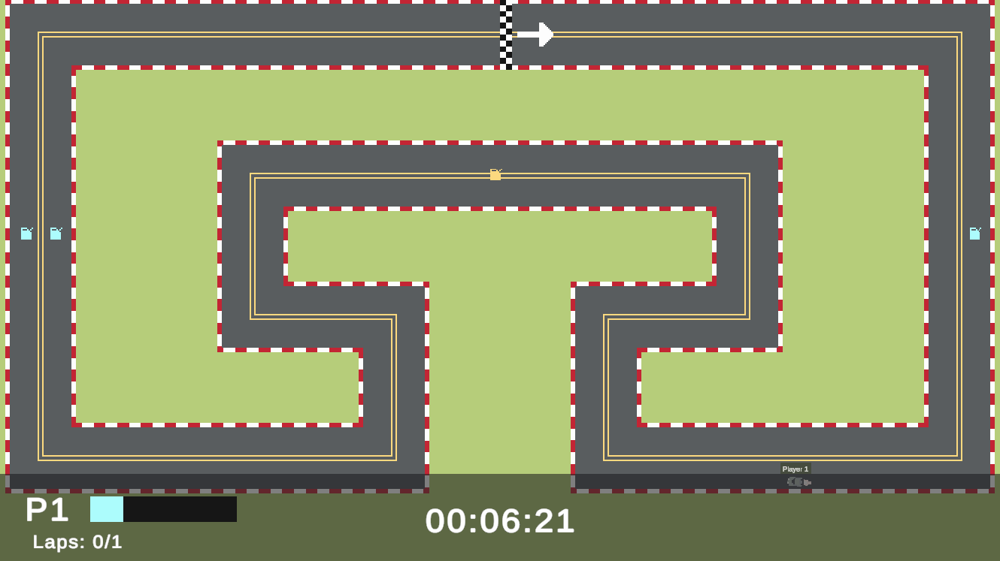

# 📄 About
Wanna race solo or with a friend? Here is a game for you!  
This is a small racing game with 3 maps you could play. Boost your way to the end with fuels! 

# 🏎️ Gameplay
Try out the game, turbo included! 🔥
 
 

  
# ⚙️ Game mechanics
- You accelerate/decelerate and steer the car like in real life and complete laps.  
- There’s a boost system where players can burn fuels to gain bonus speed and acceleration.  
- Players can gain fuel by hitting pickups within the race tracks.
- A player wins the game when they completed a determined amount of laps.

  
# 🔁 Game loop
1. Select mode and number of laps in Main Menu.
2. Choose a map.
3. Scene loads.
4. Countdown begins.
5. Players race.
    - Players can do pickups to gain fuel
    - Players can use fuels to boost their speed
6. Players win when they reach the finish line.
7. Choose to play again or go back to Main Menu.

  
# 🎮 Playing The Game
### How to load the game
Currently there are no builds for the game. The game can only be played within the Unity Editor.  
**Requirements**:
- Unity Editor version 2022.3.10f1 LTS.
- Packages used:
    - Input System 1.7.0 (From Unity Registry)

**Steps**:
1. Clone the repository to a local folder in your computer.
2. In Unity Hub, add the project folder.
3. Open the project.
4. Once loaded, open any scene in the Assets/Scenes folder and you're good to go!

**Additional details**:
- There's currently only 1 main menu scene and 3 game scenes. They are located in the [Assets/Scenes](https://github.com/proxima-k/fg-car-racer/tree/main/Assets/Scenes) directory.
- The project is structured in a way which you can start playing in whichever scene you load
    - If you are starting the game in one of the game scenes instead of the main menu scene, the game scene needs to have a game manager prefab that contains settings you can alter like _**game mode**_ and _**number of laps to win**_.
    - Otherwise, the game will start with the default settings defined within the script.

### Player Controls
There are currently two modes in the game: **One Player**, **Two Player**
| Actions | One Player | Two Player (Player 1) | Two Player (Player 2) |
| --- | --- | --- | --- |
| Accelerate/Deaccelerate | W/S | W/S | Arrow Up/Down |
| Steer Left/Right | A/D | A/D | Arrow Left/Right |
| Boost | C | C | Right Shift |
| Pause Game | Esc | Esc | Esc |

  
# 🧭 Navigating the project
To learn more about the code I’ve written, navigate it through [Assets/Scripts](https://github.com/proxima-k/fg-car-racer/tree/main/Assets/Scripts).
From there, the scripts are organized into different folders.
- [Core](https://github.com/proxima-k/fg-car-racer/tree/main/Assets/Scripts/Core): The core gameplay scripts such as car movement, input system, fuel and finish line.
- [Managers](https://github.com/proxima-k/fg-car-racer/tree/main/Assets/Scripts/Managers): The managers of the game. Contains code involving scene loading and managing game loop
- [UI](https://github.com/proxima-k/fg-car-racer/tree/main/Assets/Scripts/UI): Everything that has to do with UI. Main menu, pause menu, end game menu, etc.
- [Visuals](https://github.com/proxima-k/fg-car-racer/tree/main/Assets/Scripts/Visuals): Contains code that helps with the visuals of the game.

  
# 💭 Thought process / Lessons
### Project flow & initialization
- After learning about it. I attemped to implement a system where I could start racing within a racing scene without the need to load the main menu scene.
- If any user wants to play in a different mode and with a different number of laps to win, they could just drag a GameManager prefab to the scene and edit the values of the script attached to it.
    - You can locate the GameManager prefab in the Unity Editor project window with the path [Assets/Resources/Prefabs/](https://github.com/proxima-k/fg-car-racer/tree/main/Assets/Resources/Prefabs)
- This makes editing and playtesting the map much easier compared to loading the scene from main menu every time the game is run in the editor.

### Car physics
- I had some idea about using vectors but wasn't sure how to implement it.
- I then got the ideas solidified after watching a [video on Youtube](https://www.youtube.com/watch?v=CdPYlj5uZeI&pp=ygULY2FyIHBoeXNpY3M%3D) describing about how car physics work.
- Since I have a good foundation in physics and linear algebra, it is easier to implement.
- I simplified the individual wheels physics into a single entity to meet the project goals.

### Finish line / Laps
- I was planning to go with the checkout approach, which could also determine ranks during runtime.
- But due to time constraints, I chose to only implement the finish line
- I came up with an algorithm that checks where the car is entering from and performs a dot product.
    - The dot product is calculated between the intended enter direction and the car's enter direction.
    - If the dot product is positive, then the car is not cheating.
- With this approach, I would only require a single collider instead of multiple checkpoints that has colliders.

### Separation of Logic and UI
- One of my main goals in this project is to write clean code.
- So I used delegates for all kinds of events. With this, I can have UI scripts connect to the delegates that are within the manager scripts without the manager scripts knowing about them.
- Because of this separation, it made it so much easier to refactor some logics within the scripts.
    - Initially, I had the [GameManager](https://github.com/proxima-k/fg-car-racer/blob/main/Assets/Scripts/Managers/GameManager.cs) keep track of [CarController](https://github.com/proxima-k/fg-car-racer/blob/main/Assets/Scripts/Core/CarController.cs)s and perform methods on them. This didn't make sense as CarController means controlling the car movements, not resetting their positions or keeping track of laps passed.
    - I then refactored it to track a new script, [Participant](https://github.com/proxima-k/fg-car-racer/blob/main/Assets/Scripts/Core/Participant.cs) which contains functions that handles in-game requirements.
    - The UI remains unaffected since the delegates are still the same.

### Other considerations
Here are some of the topics that I didn't get to explore much but hope to in the future.
- Checkpoint system
    - I hope to have something that helps with checking the ranks of the cars in real time.
- Rebinding keys for players
    - Since the new input system has so much to offer, I actually spent a few hours studying the documentation to try implementing rebinding.
    - Alas, I have to prioritize finishing the project.
- Separate car stats like acceleration, max speed, steering from the [CarController](https://github.com/proxima-k/fg-car-racer/blob/main/Assets/Scripts/Core/CarController.cs)
    - I can then make them upgradable if the project grows.
- Game Manager handling too much
    - It currently handles the state of the game, resetting stuff, and initializing & instantiating prefabs. Which makes it having many lines of code.
    - I think it would be wise to break them down for cleaner code.
- Leaderboard system

### Reflections
- Discussing problems with friends definitely helped me look at them in different perspectives.
- I now understand more about writing clean code and why it's important.
- It felt very rewarding to have a codebase that is decoupled to some extent. It makes expanding the project less exhausting.

  
# 🗃️ Resources
Here are resources that helped me in the making of this project:  
- [A Youtube video](https://www.youtube.com/watch?v=CdPYlj5uZeI&pp=ygULY2FyIHBoeXNpY3M%3D) about car physics that got me started on understanding how cars work.
- Unity Forum, StackOverflow helped me with solving some issues that I don't understand when it comes to the Editor itself.
    - E.g. I can't have a serialized field of a Scene and I had to use the Object class as a serialized field to be able to assign a scene in the inspector.
- A lot of the concepts I've implemented are already learnt prior to this project and it's all thanks to the great [CodeMonkey](https://www.youtube.com/@CodeMonkeyUnity)!

  
Developed by Kent Chua
